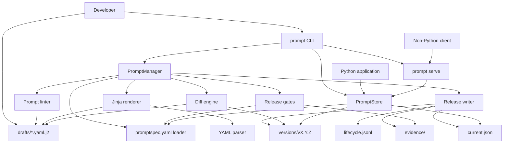
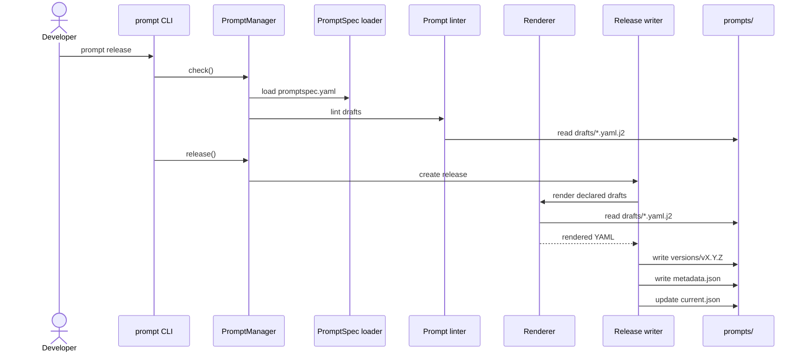
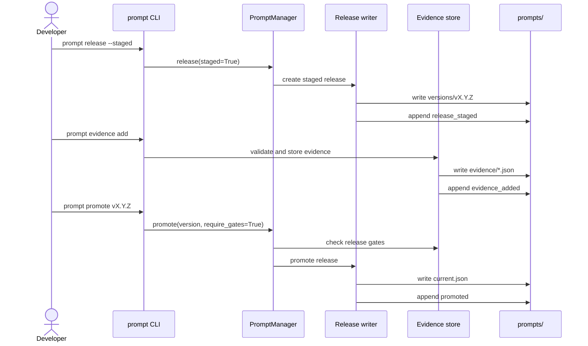
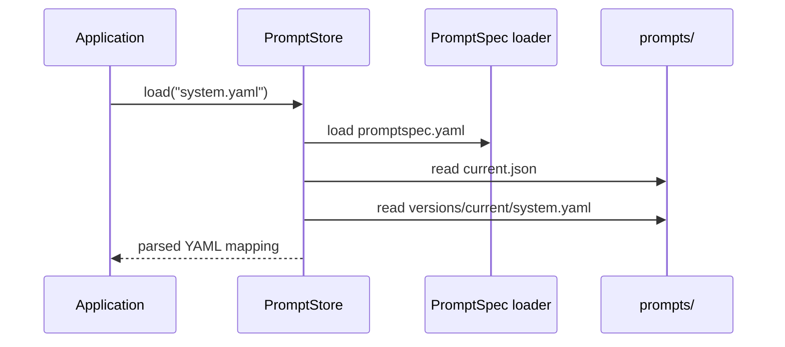
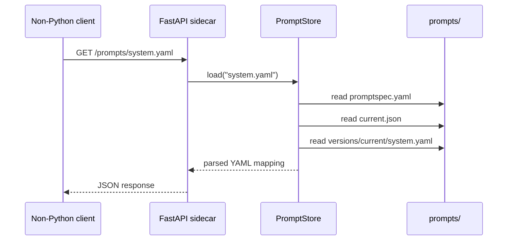

# Architecture

Promptory manages prompt lifecycle state on the filesystem. Git remains the
source of history, while Promptory creates release artifacts with explicit
metadata and a current-release pointer.

## Component Map



The core boundary is file-based. Authoring tools write `drafts/`, `versions/`,
and `current.json`; runtime tools read `promptspec.yaml`, `current.json`, and
`versions/`.

## Components

### PromptManager

`PromptManager` is the high-level authoring API. It owns project initialization,
draft recovery from the current release, prompt checks, release creation,
promotion, diffs, and rollback.

Responsibilities:

- Create the prompt directory layout and default `promptspec.yaml`.
- Load the prompt specification before authoring operations.
- Run checks before releases through the linter.
- Create immutable releases through the release writer.
- Create staged releases without updating `current.json`.
- Check release gates before promotion when requested.
- Promote an existing release by updating `current.json`.
- Point `current.json` at an existing release during rollback.
- Summarize version lifecycle state, gate status, and evidence counts.

`PromptManager` is allowed to write prompt lifecycle files. Runtime application
code should use `PromptStore` instead.

### PromptSpec Loader

The spec loader reads `promptspec.yaml` and returns a validated `PromptSpec`.
`PromptSpec` is the shared configuration object for authoring and runtime code.

Responsibilities:

- Validate managed prompt file names.
- Expose derived paths for `drafts/`, `versions/`, `current.json`, and
  `promptspec.yaml`.
- Validate `required_variables` and `max_file_bytes`.

### Prompt Linter

The linter validates drafts before release. It checks the declared prompt set,
template syntax, file size limits, required-variable declarations, and static YAML
where possible.

The linter returns user-facing errors instead of raising for normal validation
failures. The CLI prints those errors and exits non-zero.

### Renderer

The renderer turns declared Jinja draft templates into rendered YAML strings.

Responsibilities:

- Map each managed `*.yaml` file to a `drafts/*.yaml.j2` template.
- Render with Jinja `StrictUndefined`.
- Treat variables using Jinja `default` filters as optional during validation.
- Parse rendered YAML before release artifacts are written.

Rendering happens only during authoring and release. Runtime loading never
renders Jinja.

### Release Writer

The release writer owns semantic version discovery, version normalization,
version bumps, release directory creation, `metadata.json`, lifecycle events,
and `current.json`.

Responsibilities:

- List valid semantic release directories.
- Normalize versions to the `vX.Y.Z` form.
- Render drafts before writing a release.
- Write rendered YAML files and release metadata.
- Verify released prompt artifacts against metadata checksums.
- Initialize release evidence storage.
- Append lifecycle events for release creation and promotion.
- Update the current-release pointer for promoted releases.
- Remove a partially-created release directory if writing fails.

### Release Evidence

Release evidence stores immutable metadata produced by external tools for a
specific release version.

Responsibilities:

- Validate the basic evidence schema.
- Store evidence documents under `versions/<version>/evidence/`.
- Reject duplicate evidence names.
- Record revocations as new artifacts and lifecycle events.
- Leave original evidence documents untouched.
- Compare evidence between releases by status, revocation state, and simple
  scalar metrics.

Promptory does not run evals, call LLMs, manage datasets, or define metric
semantics.

### Release Gates

Release gates check whether a release has the configured evidence required for
promotion.

Responsibilities:

- Read `release_gates` from `promptspec.yaml`.
- Match required evidence by `kind` and `name`.
- Fail when required evidence is missing, revoked, or has the wrong status.
- Block promotion only when the user passes `--require-gates`.

Release gates inspect lifecycle metadata. They do not run external checks.

### Diff Engine

The diff engine compares rendered prompt content.

Responsibilities:

- Produce unified diffs between the current release and rendered drafts.
- Produce semantic summaries for current-to-draft and version-to-version
  comparisons.
- Report changed managed files, character count deltas, and scalar YAML value
  changes.
- Verify release artifact integrity against `metadata.json`.

### PromptStore

`PromptStore` is the runtime API for Python consumers. It reads released prompt
artifacts and never reads draft templates.

Responsibilities:

- Resolve the active release from `current.json`.
- List available semantic release directories.
- Validate requested prompt names against `promptspec.yaml`.
- Load one declared prompt or all declared prompts.
- Load either the active release or an explicit release version.

`PromptStore` returns parsed YAML mappings so applications can pass loaded values
to their LLM provider or internal prompt layer.

### Prompt CLI

The `prompt` CLI is a thin user interface over `PromptManager`, `PromptStore`,
and the sidecar adapter launcher.

Responsibilities:

- Run authoring commands: `init`, `draft`, `check`, `release`, `diff`, and
  `rollback`.
- Render selected lifecycle outputs as text, JSON, Markdown, or GitHub
  annotations for local use and CI.
- List release versions through `PromptStore`.
- Start the optional sidecar adapter with `prompt serve`.

### Sidecar Adapter

The sidecar adapter is a FastAPI wrapper around `PromptStore` for non-Python
consumers. It exposes released prompts over HTTP without adding a second prompt
lifecycle.

Responsibilities:

- Read the prompts directory from `PROMPTORY_PROMPTS_DIR`.
- Return service metadata, versions, current version, all prompts, or one prompt.
- Map Promptory exceptions to HTTP errors.
- Preserve the read-only runtime boundary.

## Directories

```text
prompts/
  drafts/
  versions/
  current.json
  promptspec.yaml
```

`drafts/` contains editable Jinja templates. Every managed prompt is YAML, so a
declared file such as `system.yaml` maps to `drafts/system.yaml.j2`.

`versions/` contains immutable rendered artifacts. A release directory is named
with a normalized semantic version such as `v0.1.0` and contains rendered YAML
plus lifecycle support files.

```text
versions/v0.1.0/
  system.yaml
  metadata.json
  lifecycle.jsonl
  evidence/
```

`metadata.json` is the immutable creation manifest. `lifecycle.jsonl` is an
append-only event log for post-creation lifecycle events. `evidence/` contains
immutable evidence and revocation artifacts.

`current.json` points at the active release. Rollback changes the pointer instead
of rewriting prompt artifacts.

A project can track one prompt file or many prompt files. Every entry in
`promptspec.yaml` maps to one draft template and one rendered release artifact.

## Authoring Flow



Authoring commands can inspect or mutate lifecycle state. Git remains the durable
history for source changes, while Promptory writes release artifacts for runtime
consumers.

Staged releases create rendered artifacts without updating `current.json`.
External tools can inspect that exact version and produce evidence before
promotion:



## Runtime Flow



Runtime loading is intentionally smaller than release creation. It validates the
requested file against `promptspec.yaml`, resolves the active or explicit
version, and loads rendered YAML from a known release directory.

## Invariants

- `promptspec.yaml` is the only source for managed prompt file names.
- Managed prompt files are relative `.yaml` paths.
- Absolute paths, parent traversal, duplicate files, non-YAML files, and
  `metadata.json` are invalid.
- Draft templates render with Jinja `StrictUndefined`.
- Variables with Jinja `default` filters are optional.
- Non-default Jinja variables must be listed in `required_variables`.
- Release artifacts are rendered YAML and must parse successfully before release.
- Promptory writes `versions/` and `current.json`; developers edit `drafts/`.
- Runtime code reads `current.json` and `versions/<version>/`; runtime code does
  not read `drafts/`.
- Staged releases exist in `versions/` without being pointed to by
  `current.json`.
- Release gates use configured evidence requirements to decide whether a staged
  release can be promoted with `--require-gates`.
- `metadata.json` is creation-time metadata.
- `lifecycle.jsonl` is append-only lifecycle history.
- Evidence documents are immutable; revocation adds a new artifact and event.
- Runtime loading ignores `metadata.json`, `lifecycle.jsonl`, and `evidence/`.

## Release Flow

1. Load and validate `promptspec.yaml`.
2. Render every draft template with Jinja.
3. Validate rendered YAML.
4. Create the next semantic version directory under `versions/`.
5. Write rendered YAML files, `metadata.json`, `lifecycle.jsonl`, and
   `evidence/`.
6. Update `current.json` to point at the new release unless the release is
   staged.

Release-time variables flow through `PromptManager.release(variables=...)`.
Rendered releases contain resolved YAML; runtime loading does not render Jinja.

If writing the release fails, Promptory removes the partially-created release
directory.

## Boundaries

Promptory does not deploy prompts. CI/CD, applications, or provider-specific
tools consume `current.json` and `versions/`.

The runtime contract is:

1. Create `PromptStore("prompts")`.
2. Resolve the active version with `current_version()` when needed.
3. List available releases with `list_versions()`.
4. Load active rendered YAML with `load(file_name)` or `load_all()`.
5. Load a specific release with `load(file_name, version="v0.1.0")` or
   `load_all(version="v0.1.0")`.
6. Pass the loaded values to the LLM provider or application code.

`PromptStore` validates file names against `promptspec.yaml`, reads
`current.json` for active loads, normalizes explicit versions, and loads YAML
only from known release directories. Release listings include valid semantic
version directories sorted by semantic version.

Future deployment integrations should live outside the core release path unless
they preserve the same file-based artifacts and pointer model.

## Sidecar Adapter



`prompt serve` is a sidecar adapter: a read-only HTTP process that runs
alongside a single service and exposes that service's own released prompts to
non-Python consumers (Go, TypeScript, Ruby, curl). It is not a shared
cross-repo registry; each service runs its own instance against its own
`prompts/` directory.

The adapter reads `current.json` on every request, so a `prompt release` is
immediately visible to HTTP consumers without restarting the sidecar.

The server dependencies live behind the `serve` extra:

```toml
promptory[serve]
```

The prompts directory is configured with `PROMPTORY_PROMPTS_DIR`. The CLI sets
this environment variable from `--prompts-dir` before launching Uvicorn.

Endpoints:

- `GET /` returns service metadata.
- `GET /versions` lists valid semantic release directories.
- `GET /versions/current` returns the active version from `current.json`.
- `GET /prompts` returns all rendered prompts for the active or requested
  version.
- `GET /prompts/{name:path}` returns one rendered prompt, including nested
  prompt paths such as `agents/support/system.yaml`.

The service maps `PromptLoadError` to 404 and prompt specification errors to
client or server errors depending on whether the request supplied invalid prompt
input or the repository configuration is invalid.
